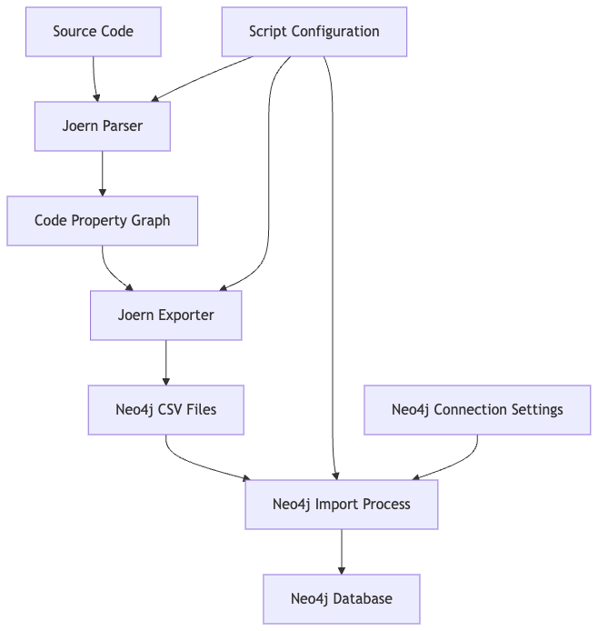

# Joern to Neo4j - Technical Documentation

## Architecture Overview

The Joern to Neo4j tool facilitates static code analysis by automating the workflow from source code parsing to graph database visualization. The architecture consists of three main components:

1. **Joern Processing**: Uses Joern's parsing and export capabilities to analyze source code
2. **Data Transformation**: Processes the exported data for Neo4j compatibility
3. **Neo4j Integration**: Imports the processed data into a Neo4j graph database



## Component Details

### 1. Joern Processing

#### Joern Parser
- **Function**: `run_joern_parse(input_path, cpg_output_path, jvm_mem)`
- **Description**: Executes `joern-parse` to analyze source code and generate a Code Property Graph (CPG)
- **Input**: Source code file or directory
- **Output**: CPG binary file

#### Joern Exporter
- **Function**: `run_joern_export(cpg_input_path, csv_output_dir, export_format, jvm_mem)`
- **Description**: Executes `joern-export` to convert the CPG to Neo4j-compatible CSV format
- **Input**: CPG binary file
- **Output**: Directory containing node and edge CSV files

### 2. Data Transformation

#### Cypher File Discovery
- **Function**: `get_cypher_files(output_dir)`
- **Description**: Locates node and edge Cypher import files generated by Joern's export
- **Input**: Export directory path
- **Output**: Lists of node and edge Cypher file paths

### 3. Neo4j Integration

#### Neo4j Import
- **Function**: `import_online_neo4j(driver, database_name, node_cypher_files, edge_cypher_files, output_dir)`
- **Description**: Imports data into Neo4j by executing modified Cypher queries
- **Process**:
  1. Optionally creates constraints in Neo4j
  2. Modifies Cypher queries to use absolute file paths
  3. Wraps queries in batch transactions for performance
  4. Executes queries against Neo4j database

## Workflow Sequence

1. **Initialization**: Parse command-line arguments and validate inputs
2. **Joern Parse**: Generate CPG from source code
3. **Joern Export**: Convert CPG to Neo4j-compatible format
4. **File Discovery**: Locate Cypher and data files
5. **Neo4j Connection**: Establish connection to Neo4j
6. **Data Import**: Execute modified Cypher queries to import data
7. **Cleanup**: Close connections and report status

## Implementation Details

### Command Execution

The script uses the `run_command()` function to execute system commands with robust error handling:

```python
def run_command(command, cwd=None):
    """Executes a shell command and logs output."""
    logging.info(f"Running command: {' '.join(command)}")
    try:
        result = subprocess.run(
            command,
            check=True,
            capture_output=True,
            text=True,
            encoding='utf-8',
            errors='replace',
            cwd=cwd
        )
        # Output logging...
        return True, result.stdout
    except subprocess.CalledProcessError as e:
        # Error handling...
        return False, stderr_output
    except Exception as e:
        # Exception handling...
        return False, str(e)
```

### Cypher Query Modification

The script transforms Joern-generated Cypher queries for optimal Neo4j import:

1. **Path Resolution**: Converts relative file paths to absolute URI paths
2. **Batched Transactions**: Wraps queries in `CALL {} IN TRANSACTIONS OF n ROWS` for performance
3. **Error Handling**: Provides detailed logging for import failures

Example transformation:

```
LOAD CSV FROM 'file:/path/to/file.csv' AS line
CREATE (n:Node {id: line.id})
```

Becomes:

```
LOAD CSV FROM 'file:///absolute/path/to/file.csv' AS line
CALL {
    WITH line
    CREATE (n:Node {id: line.id})
} IN TRANSACTIONS OF 1000 ROWS
```

### Neo4j Connectivity

The script uses the official Neo4j Python driver to connect and execute queries:

```python
driver = GraphDatabase.driver(uri, auth=(user, password))
with driver.session(database=database_name) as session:
    session.execute_write(transaction_function, parameters)
```

### Error Handling

The script implements comprehensive error handling:

- **Validation**: Checks for input path validity and required parameters
- **Connection Errors**: Detects and reports Neo4j connection issues
- **Import Errors**: Handles common file access and Cypher execution errors
- **Logging**: Detailed logging with INFO, WARNING, and ERROR levels

## Configuration Options

### JVM Memory Allocation

Controls memory available to Joern processes:

```
--jvm-mem -J-Xmx8G
```

### Neo4j Connection Settings

Configure connection to Neo4j:

```
--neo4j-uri bolt://localhost:7687
--neo4j-user neo4j
--neo4j-password password
--neo4j-database neo4j
```

### Environment Variable Support

All Neo4j settings can be specified via environment variables:

- `NEO4J_URI`
- `NEO4J_USER`
- `NEO4J_PASSWORD`
- `NEO4J_DATABASE`

## Performance Considerations

### Batch Processing

The script processes large datasets efficiently through:

- Batched transactions with configurable batch size (default: 1000)
- Transaction function pattern for proper Neo4j driver usage
- Streaming file processing to minimize memory usage

### Resource Usage

- **Memory**: Controlled through JVM memory allocation parameter
- **Disk Space**: Requires storage for CPG binary and CSV files
- **Network**: Transfers CSV data to Neo4j during import

## Security Considerations

- **Credentials**: Can be provided via environment variables to avoid command-line exposure
- **File Access**: Neo4j server must have access to the exported CSV files
- **Constraints**: Optionally creates constraints for data integrity

## Extending the Tool

### Supporting Additional Export Formats

Modify the `run_joern_export()` function to support alternative formats:

```python
def run_joern_export(cpg_input_path, csv_output_dir, export_format="alternative", jvm_mem=DEFAULT_JVM_MEM):
    # Adjust command parameters for the new format
    command = [
        "joern-export",
        jvm_mem,
        cpg_input_path,
        "--repr", "all",
        "--format", export_format,
        "--out", csv_output_dir
    ]
    # Rest of the function remains the same
```

### Adding Custom Neo4j Constraints

Modify the constraint creation in `import_online_neo4j()`:

```python
custom_constraints = [
    "CREATE CONSTRAINT IF NOT EXISTS FOR (n:CustomNode) REQUIRE n.id IS UNIQUE",
    "CREATE CONSTRAINT IF NOT EXISTS FOR (n:AnotherNode) REQUIRE n.name IS UNIQUE"
]

for constraint_query in custom_constraints:
    try:
        with driver.session(database=database_name) as session:
            session.execute_write(lambda tx: tx.run(constraint_query).consume())
    except Exception as e:
        logging.error(f"Failed to apply constraint: {e}")
```

## Troubleshooting Guide

### Joern Installation Issues

If Joern commands are not found:

1. Verify Joern is installed: `which joern`
2. Add Joern to PATH: `export PATH=$PATH:/path/to/joern/bin`
3. Check permissions: `chmod +x /path/to/joern/bin/*`

### Neo4j Connection Problems

If unable to connect to Neo4j:

1. Verify Neo4j is running: `neo4j status`
2. Check connection parameters: URI, username, password
3. Ensure Neo4j accepts remote connections (if not local)
4. Verify firewall settings

### Import Failures

If data import fails:

1. Check Neo4j logs: `neo4j/logs/debug.log`
2. Verify file paths in Cypher queries
3. Ensure Neo4j can access the CSV files
4. Check for data format issues in CSV files

## Advanced Usage Examples

### Analyzing a Java Project

```bash
python joern_to_neo4j.py /path/to/java/project \
  --jvm-mem -J-Xmx8G \
  --neo4j-database java_analysis
```

### Using Environment Variables

```bash
export NEO4J_URI=bolt://neo4j-server:7687
export NEO4J_USER=neo4j
export NEO4J_PASSWORD=secure_password
export NEO4J_DATABASE=code_analysis

python joern_to_neo4j.py /path/to/code -o custom_output
```

### Processing Large Codebases

```bash
python joern_to_neo4j.py /path/to/large/codebase \
  --jvm-mem -J-Xmx16G \
  --output-dir /data/large_analysis
```