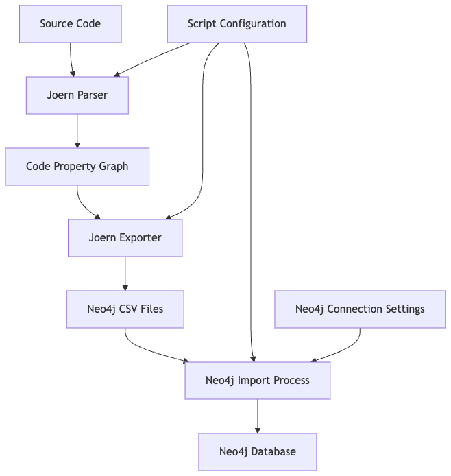

# Joern to Neo4j

This tool automates the process of analyzing source code with Joern and importing the resulting Code Property Graph (CPG) into Neo4j for further analysis and visualization.



## Overview

The Joern to Neo4j pipeline consists of three main steps:

1. **Joern Parsing**: Convert source code to a Code Property Graph (CPG)
2. **Joern Export**: Export the CPG to Neo4j-compatible CSV format
3. **Neo4j Import**: Load the CSV data into a Neo4j database using Cypher queries

This automation tool handles all three steps seamlessly, allowing security analysts and developers to quickly analyze codebases with Joern's static analysis capabilities and visualize the results in Neo4j.

## Prerequisites

- Python 3.13+
- [Joern](https://joern.io/) installed and in PATH
- [Neo4j](https://neo4j.com/) (4.x or later) instance running

## Dependencies

The project uses the following Python packages:
- `neo4j>=5.14.0`: Neo4j Python driver
- `pathlib>=1.0.1`: Object-oriented filesystem paths

Note: Joern must be installed separately as it's not available through PyPI.

## Installation

1. Clone this repository
2. Install using uv (recommended):
```bash
uv pip install .
```

Or install in development mode:
```bash
uv pip install -e .
```

3. Ensure Joern is properly installed and accessible from your PATH

## Usage

Basic usage:

```bash
python joern_to_neo4j.py /path/to/source/code
```

Advanced usage with options:

```bash
python joern_to_neo4j.py /path/to/source/code \
  -o output_directory \
  --jvm-mem -J-Xmx8G \
  --neo4j-uri bolt://localhost:7687 \
  --neo4j-user neo4j \
  --neo4j-password password \
  --neo4j-database neo4j
```

### Command Line Arguments

| Argument | Description | Default |
|----------|-------------|---------|
| `input_path` | Path to the source code to analyze | (Required) |
| `-o, --output-dir` | Directory for intermediate files | `joern_neo4j_output` |
| `--jvm-mem` | JVM memory allocation for Joern | `-J-Xmx4G` |
| `--neo4j-uri` | Neo4j Bolt URI | `bolt://localhost:7687` |
| `--neo4j-user` | Neo4j username | `neo4j` |
| `--neo4j-password` | Neo4j password | (Required or from env) |
| `--neo4j-database` | Target Neo4j database name | `neo4j` |

### Environment Variables

The following environment variables can be used instead of command-line arguments:

- `NEO4J_URI`: Neo4j Bolt URI
- `NEO4J_USER`: Neo4j username
- `NEO4J_PASSWORD`: Neo4j password
- `NEO4J_DATABASE`: Target Neo4j database name

## How It Works

1. **Joern Parse**: The script runs `joern-parse` on the input source code to generate a CPG binary file.
2. **Joern Export**: It then uses `joern-export` to convert the CPG to Neo4j-compatible CSV files.
3. **File Discovery**: The script locates node and edge Cypher files from the export.
4. **Neo4j Import**: It modifies the Cypher queries to use absolute file paths and batched operations, then executes them against the Neo4j database.

## Troubleshooting

### Common Issues

1. **Joern commands not found**: Ensure Joern is installed and in your PATH.
2. **Neo4j connection errors**: Verify Neo4j is running and credentials are correct.
3. **File access errors**: Check that Neo4j can access the exported CSV files.
4. **Memory issues**: If processing large codebases, increase JVM memory with `--jvm-mem`.

### Logging

The script provides detailed logging to help diagnose issues:

- INFO level: Normal operation logs
- WARNING level: Potential issues that don't stop execution
- ERROR level: Failures that prevent successful completion

## License

[MIT License](LICENSE)

## Acknowledgements

This tool builds on the capabilities of:
- [Joern](https://joern.io/) - The open-source code analysis platform
- [Joern git](https://github.com/joernio/joern) - The repo for the open-source code analysis platform
- [Neo4j](https://neo4j.com/) - The graph database platform
